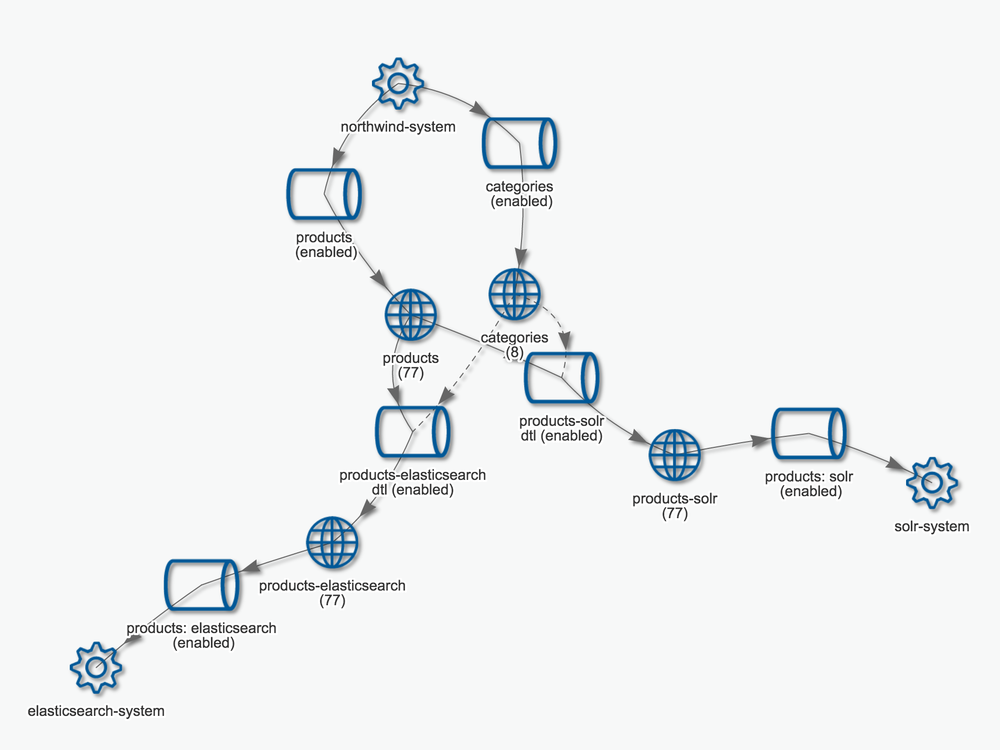
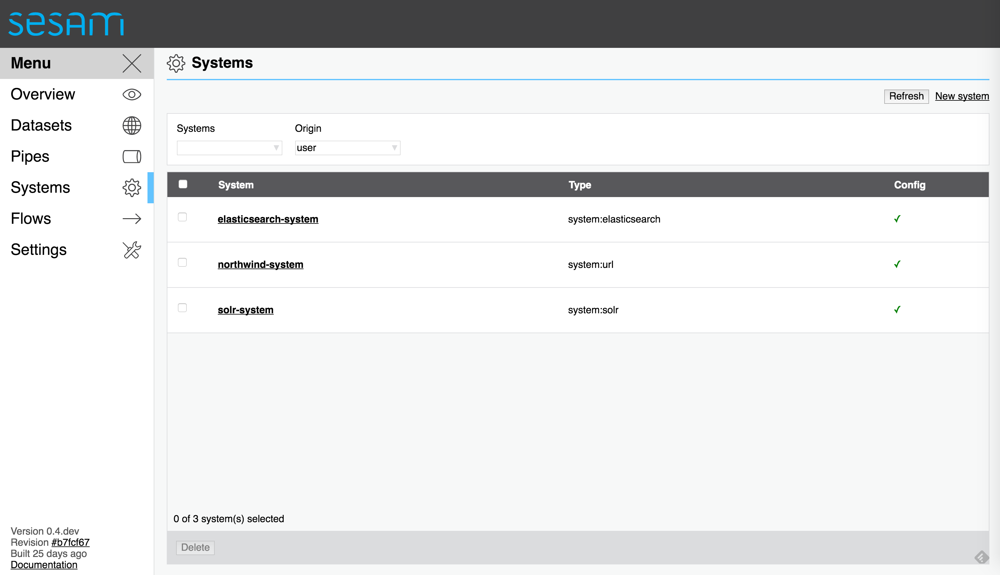
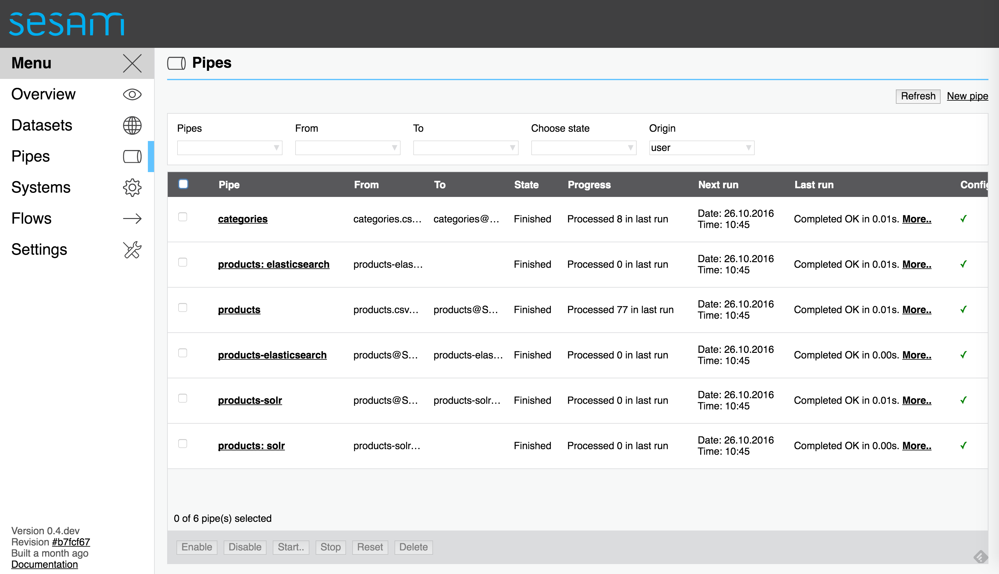
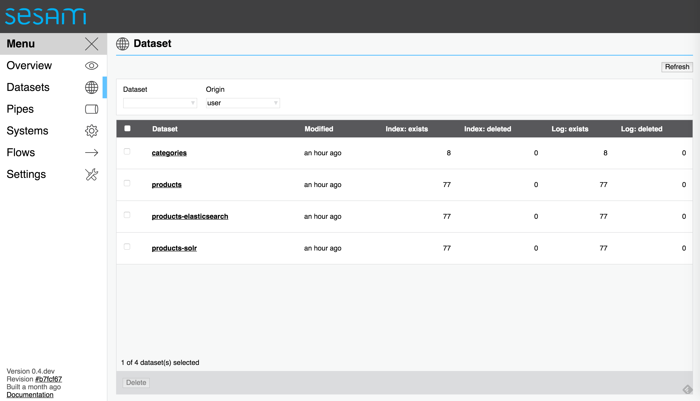

===========================================================
Search indexing pipelines with automatic cache invalidation
===========================================================

.. contents:: Table of Contents
   :depth: 2
   :local:

Introduction
============

This is a short introduction to how you can build an indexing pipeline with Sesam. It showcases how easy it is to pipe data into Sesam, transform the data and pipe data out of Sesam and into Apache Solr and Elasticsearch. We'll also see that we get incremental and automatic reprocessing of the data for free.

These are the steps we'll go through to complete our sample project:

* Run Apache Solr in a Docker container.

* Run Elasticsearch in a Docker container.
  
* Load data about products and categories from CSV files.

* Enrich the products by combining it with the category information.
  
* Index the products in Apache Solr

* Index the products in Elasticsearch

* Experience how dependency tracking lets us have cache invalidation for free.

The product data we'll be using is taken from the `Northwind database <https://www.microsoft.com/en-us/download/details.aspx?id=23654>`_.

We'll assume that you already have Sesam installed and running at this point. You can find information on how to install it `here <https://docs.sesam.io/overview.html>`_.

The first thing we'll do is to start up the Apache Solr and Elasticsearch servers. For simplicity we'll just start up two Docker containers.

Setting up Apache Solr
======================

Run this command in a new terminal window to start the Apache Solr service:

::
   
  $ docker run --name solr --rm -p 8983:8983 solr:6.2.1 solr-create -c northwind

The server will run in the foreground, so you can see the log that it produces. The Apache Solr API listens on port 8983. The ``solr`` container creates an index called ``northwind`` when it starts up. This index uses a default Apache Solr schema, so we'll define some extra Apache Solr field definitions that we'll use to index our products.

Execute the following command to register the field definitions via the API. See the `northwind-solr-schema.sh <https://github.com/sesam-io/search-indexes-example/blob/master/northwind-solr-schema.sh>`_ for details:

::

   $ sh northwind-solr-schema.sh

Apache Solr is now ready to receive documents to be index. Its user interface can be accessed at `http://localhost:8983/solr/#/northwind <http://localhost:8983/solr/#/northwind>`_.

Setting up Elasticsearch
========================

Next up is the Elasticsearch service. Run this command in a new terminal window:

::
   
  $ docker run --name elasticsearch --rm -p 9200:9200 -p 9300:9300 elasticsearch:2.4.1

The server will run in the foreground, so you can see the log that it produces. The Elasticsearch API listens on port 9200.

Now we can create the ``northwind`` index and define the field mappings needed to index our products. Execute the following command to register the field mappings. See the `northwind-elasticsearch-mapping.sh <https://github.com/sesam-io/search-indexes-example/blob/master/northwind-elasticsearch-mapping.sh>`_ for details:

::

  $ sh northwind-elasticsearch-mapping.sh

Serve the CSV files
===================

In order for Sesam to be able to read the CSV files we'll have to serve them via an HTTP server. It's easy to start one. Run the following command in a new terminal window to run a web server that binds to port 8000:

::

  $ python3 -m http.server
  Serving HTTP on 0.0.0.0 port 8000 ...

This will serve files from the current directory. Make sure that ``search-indexes-example`` is the working directory.

Importing the Sesam configuration
=================================

In the Github project there are three Sesam configuration files:

* `products.conf.json <https://github.com/sesam-io/search-indexes-example/blob/master/products.conf.json>`_ contains `the systems <https://docs.sesam.io/configuration.html#systems>`_ and `the pipes <https://docs.sesam.io/configuration.html#pipes>`_ for loading the two CSV files `products.csv <https://github.com/sesam-io/search-indexes-example/blob/master/products.csv>`_ and `categories.csv <https://github.com/sesam-io/search-indexes-example/blob/master/categories.csv>`_ into the datasets ``products`` and ``categories``.

* `solr.conf.json <https://github.com/sesam-io/search-indexes-example/blob/master/solr.conf.json>`_ contains the system and the pipe for joining the ``products`` dataset with data from the ``categories`` dataset. The result is written to the ``products-solr`` dataset. The configuration file also contains the pipe that sends the entities in the ``products-solr`` dataset to Apache Solr.

* `elasticsearch.conf.json <https://github.com/sesam-io/search-indexes-example/blob/master/elasticsearch.conf.json>`_ contains the system and the pipe for joining the ``products`` dataset with data from the ``categories`` dataset. The result is written to the ``products-elasticsearch`` dataset. The configuration file also contains the pipe that sends the entities in the ``products-elasticsearch`` dataset to Elasticsearch.

Edit the ``*.conf.json`` files
------------------------------

Before we import the configuration into the Sesam service we'll have to edit the IP addresses in the ``*.conf.json`` files. Open the files in a text editor and replace the ``YOUR-IP-HERE`` tokens with the IP address of your machine. Note that we here assume that all the services bind to the same IP address, namely the one of your local machine. We also assume that Sesam will be able to reach this IP address.

Instead of editing the files you can use the ``sed`` tool to replace the token (note: replace ``1.2.3.4`` with your actual IP address):

::
   
  # If you're on macOS and have the BSD version of sed 
  $ sed -i '' 's/YOUR-IP-HERE/1.2.3.4/' *.conf.json

::
   
  # If you're on Linux and have the GNU version of sed
  $ sed -i 's/YOUR-IP-HERE/1.2.3.4/' *.conf.json
  
Import the configuration
------------------------

Now, with the help of the `sesam <https://docs.sesam.io/commandlineclient.html>`_ command line client, we import the configuration files into Sesam like this:

::

  $ sesam import *.conf.json
  Read 10 config entities from these config-files:
    elasticsearch.conf.json
    products.conf.json
    solr.conf.json

Flow diagram
^^^^^^^^^^^^

If we now open the *Flows* page in the `Sesam Management Studio <http://localhost:9042/gui>`_ we'll now see a flow diagram that looks like this:

Systems
^^^^^^^

There are three systems, one that serves the CSV files, one for the Apache Solr service and one for the Elasticsearch service.

Pipes
^^^^^

There are six pipes.

* Two pipes that read the CSV files ``products.csv`` and ``categories.csv`` and write their output to the datasets ``products`` and ``categories``.

* One pipe for enriching products that are to be indexed into Apache Solr. These are written to the ``products-solr`` dataset.

* One pipe for sending the products in the ``products-solr`` dataset to Apache Solr.
  
* One pipe for enriching products that are to be indexed into Elasticsearch. These are written to the ``products-elasticsearch`` dataset.

* One pipe for sending the products in the ``products-elasticsearch`` dataset to Elasticsearch.

After a few seconds all pipes have pumped and the data have been pushed through them. At this point there should now be data in Apache Solr and Elasticsearch.

Datasets
^^^^^^^^

Finding the product named "Röd Kaviar"
--------------------------------------

Search Apache Solr for products with "kaviar" in the ``productName`` field:

::
   
  $ curl 'http://localhost:8983/solr/northwind/select?indent=on&q=productName:kaviar&wt=json'

  {
    "responseHeader":{
      "status":0,
      "QTime":153,
      "params":{
        "q":"productName:kaviar",
        "indent":"on",
        "wt":"json"}},
    "response":{"numFound":1,"start":0,"docs":[
        {
          "discontinued":0,
          "categoryID":8,
          "quantityPerUnit":"24 - 150 g jars",
          "id":"73",
          "productName":"Röd Kaviar",
          "unitPrice":15.0,
          "productID":73,
          "categoryDesc":"Seaweed and fish",
          "reorderLevel":5,
          "unitsInStock":101,
          "categoryName":"Seafood",
          "supplierID":17,
          "unitsOnOrder":0,
          "_version_":1549187607090429952}]
    }}

Search Elasticsearch for products with "kaviar" in the ``productName`` field:

::

  $ curl -s -XPOST 'http://localhost:9200/northwind/_search' -d '{
    "query": {
      "match": {
        "_all": "kaviar"
      }
    }
  }' | jq . -S
  
  {
    "_shards": {
      "failed": 0,
      "successful": 1,
      "total": 1
    },
    "hits": {
      "hits": [
        {
          "_id": "73",
          "_index": "northwind",
          "_score": 0.8719984,
          "_source": {
            "categoryDesc": "Seaweed and fish",
            "categoryID": "8",
            "categoryName": "Seafood",
            "discontinued": "0",
            "productID": "73",
            "productName": "Röd Kaviar",
            "quantityPerUnit": "24 - 150 g jars",
            "reorderLevel": "5",
            "supplierID": "17",
            "unitPrice": "15.00",
            "unitsInStock": "101",
            "unitsOnOrder": "0"
          },
          "_type": "product"
        }
      ],
      "max_score": 0.8719984,
      "total": 1
    },
    "timed_out": false,
    "took": 106
  }

As we can see from the result the product with ``productID`` of ``73`` is called ``Röd Kaviar``. This means that there are now products indexed in Apache Solr and Elasticsearch.

Finding all products in category ``8``
--------------------------------------

These are the commands that we can run to get a list of products in a given category, in this case category ``8`` (``Seaweed and fish``):

In Apache Solr:

::

  $ curl 'http://localhost:8983/solr/northwind/select?indent=on&q=categoryID:8&wt=json'

In Elasticsearch:

::
   
  $ curl -s -XPOST 'http://localhost:9200/northwind/_search' -d '{
     "query" : {
       "term" : { "categoryID" : 8 }
     }
  }' | jq . -S

The results are omitted for brevity, but there are 12 products in category ``8``. ``Röd Kaviar`` is one of them.

Reflecting changes made in the data sources
===========================================

We've seen that data flows automatically from CSV files on disk via Sesam and then to Apache Solr and Elasticsearch. This is great, but what happens when information about products change?

Change tracking
---------------

Lets say that the name of a product change. Try changing the name of ``Röd Kaviar`` to ``Gul Kaviar`` by editing ``products.csv``. If you now wait a few seconds you'll see that the entity has changed in the ``products`` dataset and that the search indexes have been updated.

In Apache Solr:

::
   
  $ curl 'http://localhost:8983/solr/northwind/select?indent=on&q=productName:kaviar&wt=json'
  {
    "responseHeader":{
      "status":0,
      "QTime":3,
      "params":{
        "q":"productName:kaviar",
        "indent":"on",
        "wt":"json"}},
    "response":{"numFound":1,"start":0,"docs":[
        {
          "discontinued":0,
          "categoryID":8,
          "quantityPerUnit":"24 - 150 g jars",
          "id":"73",
          "productName":"Gul Kaviar",
          "unitPrice":15.0,
          "productID":73,
          "categoryDesc":"Seaweed and fish",
          "reorderLevel":5,
          "unitsInStock":101,
          "categoryName":"Seafood",
          "supplierID":17,
          "unitsOnOrder":0,
          "_version_":1549230226719899648}]
    }}

In Elasticsearch:

::
   
  $ curl -s -XPOST 'http://localhost:9200/northwind/_search' -d '{
      "query": {
        "match": {
          "_all": "kaviar"
        }
      }
    }' | jq . -S
  {
    "_shards": {
      "failed": 0,
      "successful": 1,
      "total": 1
    },
    "hits": {
      "hits": [
        {
          "_id": "73",
          "_index": "northwind",
          "_score": 0.79839313,
          "_source": {
            "categoryDesc": "Seaweed and fish",
            "categoryID": "8",
            "categoryName": "Seafood",
            "discontinued": "0",
            "productID": "73",
            "productName": "Gul Kaviar",
            "quantityPerUnit": "24 - 150 g jars",
            "reorderLevel": "5",
            "supplierID": "17",
            "unitPrice": "15.00",
            "unitsInStock": "101",
            "unitsOnOrder": "0"
          },
          "_type": "product"
        }
      ],
      "max_score": 0.79839313,
      "total": 1
    },
    "timed_out": false,
    "took": 22
  }

Great. Sesam regularly polls data sources for changes and then only stores updates to entities that have changed.

Deletion detection
------------------

If you try to remove a CSV row you'll also see this reflected in the datasets and in the search indexes. First, lets verify that there is a product called ``Gudbrandsdalsost`` in our search indexes:

In Apache Solr:

::
   
  $ curl 'http://localhost:8983/solr/northwind/select?indent=on&q=productName:gudbrandsdalsost&wt=json'
  
  {
    "responseHeader":{
      "status":0,
      "QTime":5,
      "params":{
        "q":"productName:gudbrandsdalsost",
        "indent":"on",
        "wt":"json"}},
    "response":{"numFound":1,"start":0,"docs":[
        {
          "discontinued":0,
          "categoryID":4,
          "quantityPerUnit":"10 kg pkg.",
          "id":"69",
          "productName":"Gudbrandsdalsost",
          "unitPrice":36.0,
          "productID":69,
          "categoryDesc":"Cheeses",
          "reorderLevel":15,
          "unitsInStock":26,
          "categoryName":"Dairy Products",
          "supplierID":15,
          "unitsOnOrder":0,
          "_version_":1549187607088332800}]
    }}

In Elasticsearch:

::

  $ curl -s -XPOST 'http://localhost:9200/northwind/_search' -d '{
    "query": {
      "match": {
        "_all": "gudbrandsdalsost"
      }
    }
  }' | jq . -S

  {
    "_shards": {
      "failed": 0,
      "successful": 1,
      "total": 1
    },
    "hits": {
      "hits": [
        {
          "_id": "69",
          "_index": "northwind",
          "_score": 1.0201541,
          "_source": {
            "categoryDesc": "Cheeses",
            "categoryID": "4",
            "categoryName": "Dairy Products",
            "discontinued": "0",
            "productID": "69",
            "productName": "Gudbrandsdalsost",
            "quantityPerUnit": "10 kg pkg.",
            "reorderLevel": "15",
            "supplierID": "15",
            "unitPrice": "36.00",
            "unitsInStock": "26",
            "unitsOnOrder": "0"
          },
          "_type": "product"
        }
      ],
      "max_score": 1.0201541,
      "total": 1
    },
    "timed_out": false,
    "took": 104
  }
    
Now, let's remove the row with ``productID`` of ``69`` from ``products.csv``. After a little while you'll see that the entity with id ``69`` has been marked as ``_deleted`` true in the datasets. Sesam is able to detect deletes by discovering that identities have disappeared in the data source.

If you now wait a few seconds and then rerun the last two queries you'll see that ``Gudbrandsdalsost`` has disappeared from the search indexes. All thanks to *deletion detection*.

::
   
  $ curl 'http://localhost:8983/solr/northwind/select?indent=on&q=productName:gudbrandsdalsost&wt=json'
  {
    "responseHeader":{
      "status":0,
      "QTime":20,
      "params":{
        "q":"productName:gudbrandsdalsost",
        "indent":"on",
        "wt":"json"}},
    "response":{"numFound":0,"start":0,"docs":[]
    }}

::
   
  $ curl -s -XPOST 'http://localhost:9200/northwind/_search' -d '{
      "query": {
        "match": {
          "_all": "gudbrandsdalsost"
        }
      }
    }' | jq . -S
    
  {
    "_shards": {
      "failed": 0,
      "successful": 1,
      "total": 1
    },
    "hits": {
      "hits": [],
      "max_score": null,
      "total": 0
    },
    "timed_out": false,
    "took": 29
  }

The magic of automatic cache invalidation
-----------------------------------------

OK, but what happens if we change the name of a category? This would be a change that is not directly part of a product, but it is a change in a related object. Sesam also solves this rather difficult problem, i.e. the *cache invalidation problem*. The naïve approach would be to reprocess all the datasets. This is a rather expensive operation, so if it could be done incrementally instead that would save both compute resources and time spent doing it.

Remember the ``Röd Kaviar``, now called ``Gul Kaviar``, product? That product is part of category ``8`` which has a category description ``Seaweed and fish``. Lets change ``categoryDesc`` to ``"Seaweed, mollusks and fish"``. Edit the file ``categories.csv`` to do so.

Now, if you wait a little you'll see that all the products in category ``8`` have been *tracked*. You can see this because the category ``8`` products in the ``products`` dataset now have a property called ``_tracked`` set to ``true``. Our ``Gul Kaviar`` product is one such product:

::

  {
    "_deleted": false,
    "_hash": "f452d5637d8855472d4429591769a740",
    "_id": "73",
    "_previous": 77,
    "_tracked": true,
    "_ts": 1477462739332689,
    "_updated": 82,
    "categoryID": "8",
    "discontinued": "0",
    "productID": "73",
    "productName": "Gul Kaviar",
    "quantityPerUnit": "24 - 150 g jars",
    "reorderLevel": "5",
    "supplierID": "17",
    "unitPrice": "15.00",
    "unitsInStock": "101",
    "unitsOnOrder": "0"
  }

Tracking triggers reprocessing of those products. This means that they will get reprocessed into the ``products-solr`` and ``products-elasticsearch`` datasets and then reindexed by Apache Solr and Elasticsearch. Let's check.

In Apache Solr:

::
   
  $ curl 'http://localhost:8983/solr/northwind/select?indent=on&q=productName:kaviar&wt=json'
  {
    "responseHeader":{
      "status":0,
      "QTime":34,
      "params":{
        "q":"productName:kaviar",
        "indent":"on",
        "wt":"json"}},
    "response":{"numFound":1,"start":0,"docs":[
        {
          "discontinued":0,
          "categoryID":8,
          "quantityPerUnit":"24 - 150 g jars",
          "id":"73",
          "productName":"Gul Kaviar",
          "unitPrice":15.0,
          "productID":73,
          "categoryDesc":"Seaweed, mollusks and fish",
          "reorderLevel":5,
          "unitsInStock":101,
          "categoryName":"Seafood",
          "supplierID":17,
          "unitsOnOrder":0,
          "_version_":1549231997884301312}]
    }}
    
In Elasticsearch:

::

  $ curl -s -XPOST 'http://localhost:9200/northwind/_search' -d '{
      "query": {
        "match": {
          "_all": "kaviar"
        }
      }
    }' | jq . -S
  {
    "_shards": {
      "failed": 0,
      "successful": 1,
      "total": 1
    },
    "hits": {
      "hits": [
        {
          "_id": "73",
          "_index": "northwind",
          "_score": 0.82312953,
          "_source": {
            "categoryDesc": "Seaweed, mollusks and fish",
            "categoryID": "8",
            "categoryName": "Seafood",
            "discontinued": "0",
            "productID": "73",
            "productName": "Gul Kaviar",
            "quantityPerUnit": "24 - 150 g jars",
            "reorderLevel": "5",
            "supplierID": "17",
            "unitPrice": "15.00",
            "unitsInStock": "101",
            "unitsOnOrder": "0"
          },
          "_type": "product"
        }
      ],
      "max_score": 0.82312953,
      "total": 1
    },
    "timed_out": false,
    "took": 23
  }

As you can see the ``Gul Kaviar`` product have have an updated ``categoryDesc`` field. Try executing the category ``8`` queries once more and you'll see that they've all been updated.

That's pretty convenient! This is all thanks to *dependency tracking* and automatic cache invalidation. 

This concludes our little walkthrough of how we can build an indexing pipeline with Sesam. Read more about the *Sesam Data Integration Platform* in the `documentation <https://docs.sesam.io/>`_.
